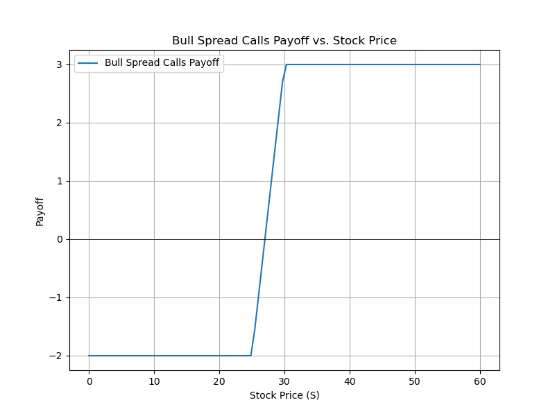

# Options Pricing with Python Scripts

This repository contains Python scripts to price options using the Black-Scholes-Merton (BSM) model and a strategy builder pattern. The key components are:

- **`bsm_formulas.py`**: Contains the implementations of the Black-Scholes-Merton formula for pricing vanilla options (calls and puts).
- **`options_builder.py`**: Implements a combination of the Builder and Strategy patterns to create options strategies from vanilla puts and calls.

## Usage

To use the **OptionBuilder** to create a **Bull Spread Call** strategy, follow the steps below:

1. Import the `OptionBuilder` class.
2. Define the strike prices and premiums for the options.
3. Use the `OptionBuilder` to build the strategy.
4. Evaluate and plot the strategy.

### Example Usage: Bull Spread Call

```python
from options_builder import OptionBuilder

builder = OptionBuilder()

# Define the strikes and premiums
k_long_call = 25  # Strike price for long call
p_long_call = 10   # Premium for long call

k_short_call = 30  # Strike price for short call
p_short_call = 8   # Premium for short call

# Build the option strategy
option_strategy = (
    builder.build_long_call(k_long_call, p_long_call)
           .build_short_call(k_short_call, p_short_call)
           .build()
)

# Evaluate the strategy at a given stock price
stock_price = 30
result = option_strategy.evaluate(stock_price)
print(f"Option strategy result at stock price {stock_price}: {result}")

# Plot the strategy over a range of stock prices
option_strategy.plot(stock_price_range=(0, 60), strategy_name="Bull Spread Calls")
```

Output:




